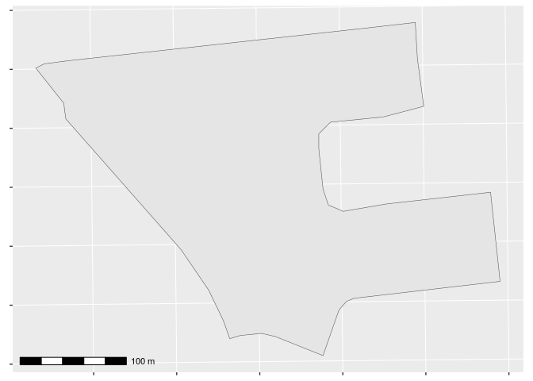
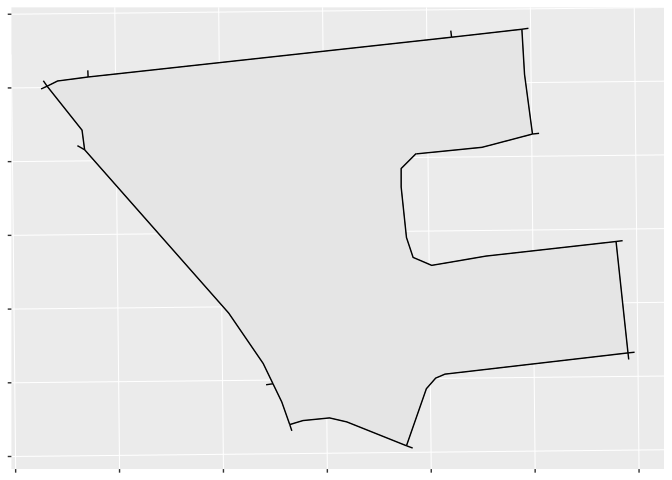
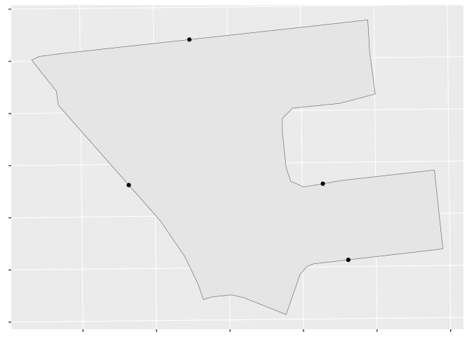
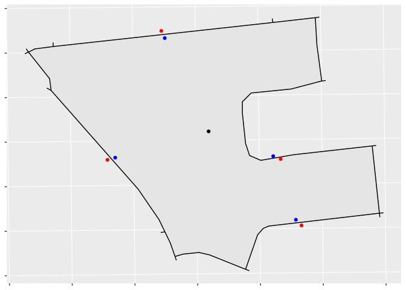
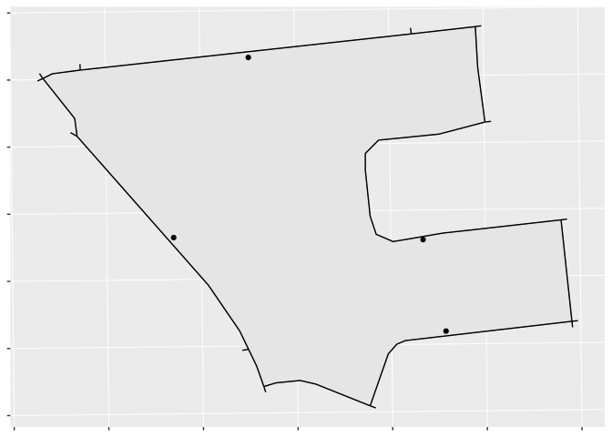

<!-- README.md is generated from README.Rmd. Please edit that file -->

# pseudohouseholds

<!-- badges: start -->

[](https://github.com/chris31415926535/pseudohouseholds/actions/workflows/R-CMD-check.yaml)
[](https://app.codecov.io/gh/chris31415926535/pseudohouseholds?branch=main)
<!-- badges: end -->

A code-based reproducible package for generating representative points
along road networks within regions–“pseudohouseholds”–that can be used
for population-weighted travel analyses.

## Installation

You can install the current published version of pseudohouseholds from
[CRAN](https://cran.r-project.org/) with:

``` r
install.packages("pseudohouseholds")
```

You can install the development version of pseudohouseholds from
[GitHub](https://github.com/) with:

``` r
# install.packages("devtools")
devtools::install_github("chris31415926535/pseudohouseholds")
```

## Summary

This vignette provides an overview of what pseudohouseholds (PHHs) are,
and how you can use the **pseudohouseholds** package to help create
them.

## What are pseudohouseholds?

In brief, PHHs are representative points placed along road segments and
inside regions that provide spatial distributions of some
region-specific property (in practice, usually population). They provide
an approximate way of “spreading out” regional population distributions
that can be helpful when doing travel analyses. We say that PHHs are
“pseudo” households because they do not represent actual buildings or
households, but they approximate the distribution of households by
creating a set of populated points where we think the households are
likely to be. This can allow us to create finer-grained travel or
coverage analyses.

By contrast, many travel analyses assume that a region’s entire
population is concentrated at a single point, usually the region’s
centroid. While this assumption can be valid for smaller regions like
city blocks, it breaks in larger or rural regions where the population
may be more dispersed, or regions with unusual shapes that may not
contain their own centroids.

## The algorithm for creating pseudohouseholds

Let’s walk through the algorithm by giving a demonstration using test
data included with the package. We’ll consider a single dissemination
block (DB) in Ottawa, Ontario, with unique identifier (DBUID)
“35061699003”. DBs are the smallest region at which Statistics Canada
makes population data available, so they’re a good starting point for a
fine-grained analysis.

Here we load our packages, isolate our DB, and print it to the console:

``` r
library(sf)
#> Linking to GEOS 3.10.2, GDAL 3.4.1, PROJ 8.2.1; sf_use_s2() is TRUE
library(ggplot2)
library(ggspatial)
library(pseudohouseholds)

db <- dplyr::filter(pseudohouseholds::ottawa_db_shp, DBUID == "35061699003")

print(db)
#> Simple feature collection with 1 feature and 2 fields
#> Geometry type: MULTIPOLYGON
#> Dimension:     XY
#> Bounding box:  xmin: 369747.8 ymin: 5027016 xmax: 370185.7 ymax: 5027330
#> Projected CRS: NAD83 / MTM zone 9
#> # A tibble: 1 × 3
#>   DBUID       dbpop2021                                                 geometry
#> * <chr>           <dbl>                                       <MULTIPOLYGON [m]>
#> 1 35061699003       125 (((370113.7 5027251, 370075.7 5027241, 370026.3 5027236…
```

Note that its coordinate reference system (CRS) is *projected*.
Specifically, it’s using NAD83/MTM zone 9 (32189) which gives units in
meters. It’s important to use a projected CRS with this package.

Let’s also plot it to get an idea of its scale:



This DB is a few hundred meters across, borders Bank St. on its west,
and extends to the east into an irregularly shaped residential area.
From the printout above, we see that it had a population of 125 in 2021.

### If the region is unpopulated, optionally return a default point.

By default, if a region is unpopulated it receives one single point with
population 0 of `phh_type` type 1. This point will be the centroid if it
is inside the region, otherwise it will be an approximation of the
region’s “pole of inaccessibility.” Details are provided below.

### Find road segments intersecting or near the region

First, we identify road segments that either intersect with the region
or come within a specified buffer. The default buffer is 5 meters, which
we adopt here, although larger or smaller buffers may be appropriate in
different settings.

Plotting our DB and the road segments that intersect it:



### Create initial points by sampling along the road segments

Next we sample points along these road segments. The sampling frequency
is given by the parameter `phh_density`, which is passed along directly
to the function `sf::st_line_sample()` and is measured in units of “PHHs
per unit.” The default value is 0.005 which, in meters, translates to
one PHH every 200 meters. Note that this is for our initial sampling,
and that the final PHHs may be closer or farther than this.



Optionally, users can set a desired minimum number of regional PHHs
using the parameter `min_phhs_per_region`, which can be helpful with
smaller regions (e.g. small city blocks).

### Create candidate PHHs beside the road network

We want our PHHs to be *inside* our DB, so our next step is to perturb
these points by the distance `delta_distance` to try to create
candidates within the region. To do so, we:

- Find the DB’s centroid;
- Create a “pull” set of candidates that are moved towards the centroid
  by `delta_distance`; and,
- Create a “push” set of candidates that are moved away from the
  centroid by `delta_distance`.



As can be seen, most of the blue “pull” candidates are within the DB and
most of the “push” candidates are outside; however, because of the DB’s
odd geometry, one “pull” candidate is outside, and one “push” is inside.
Creating two sets of candidates increases the algorithm’s processing
overhead, but it helps to ensure that our PHHs are distributed the way
we want.

### Keep only candidates within the region

Next, we keep only those candidate PHHs that are inside the region using
a spatial filter.



### (If necessary) If no valid points are returned, sample radially around our on-street points

The push/pull algorithm may not return valid PHHs in some cases, for
example if the region is concave and has only small intersections with
any road. In this case we use a backup algorithm that samples 16
candidate points distributed radially with radius `delta_distance`
around our on-street point and selects the first candidate point within
the region.

### (If necessary) If *still* no valid points are returned, return a default region point.

If for any reason the algorithm has still not found a valid candidate
PHH, it will now return a single default point. It will return the
centroid if the centroid is inside the region, or else an approximation
of the visual centre of the region. In either case this point will have
`phh_type` 2, indicating no valid PHHs were found using the standard
methods.

### (Optionally) Ensure our PHHs have a minimum population

If we are assigning populations to our PHHs, we next check to ensure
each PHH will have at least some minimum population set by the parameter
`min_phh_pop`. This is helpful for “thinning out” PHHs in large
sparsely-populated rural areas, where the default line sampling density
would lead to a large number of PHHs with populations less than 1.

This can be disabled by setting `min_phh_pop` to 0.

### (Optionally) Remove candidates that are too close to others

Optionally, we can remove any PHHs that are within `min_phh_distance`
units of another. This is helpful to reduce artificial over-crowding
caused by specific road features: for example, if many short road
segments converge, each could receive a candidate PHH from
`sf::st_line_sample()`.

### Distribute regional population among PHHs

We now have a set of points that are near a road, within the region, and
not too close together. The final step is to assign each PHH an equal
share of the region’s population.

## Considerations

### The final number of PHHs may be more or less than you expect.

The algorithm attempts to satisfy several competing criteria–the minimum
number of PHHs per region, the minimum population of those PHHs, and the
minimum distance between them–and it may not be possible to meet them
all. In particular, it will make its best effort to satisfy
`min_phhs_per_region`, but `min_phh_pop` and `min_phh_distance` take
precedence.

### Any input roads may receive PHHs, so ensure only habitable roads are used as inputs.

Standard GIGO principles apply, so if there are any roads where you
don’t want PHHs (e.g. highways, service roads, unpaved trails), take
care to remove them beforehand.

### PHHs do not correspond directly to dwellings, and should only be used as a proxy to “smooth out” populations for analysis.

Any analysis using PHHs should be clear that they rely on approximations
and do not provide “true” population distributions (whatever that might
even mean). While PHHs can provide advantages over centroid-based
analyses, they also have limitations and should be used with these
limitations in mind.

## Details

### The variable `phh_type`

- 1: Normal PHH
- 2: Unpopulated region
- 3: No valid PHHs found

### The default point

If a region is unpopulated or if it is no valid PHHs can be found, the
function will return the region’s “default point.” If the region’s
centroid is inside it, the default point is the centroid. If the
centroid is outside the region, we use a simple algorithm to choose a
point that is approximately in the region’s “pole of inaccessibility,”
or farthest from each border: we randomly sample 100 points inside the
region, and choose the one that is farthest from any border.

Such points are flagged as either `phh_type` 1 (unpopulated) or
`phh_type` 2 (populated but no valid PHHs found), and care should be
taken when using these variables for analysis since they may be farther
from road networks than regular PHHs and may not represent actual
population distributions.
